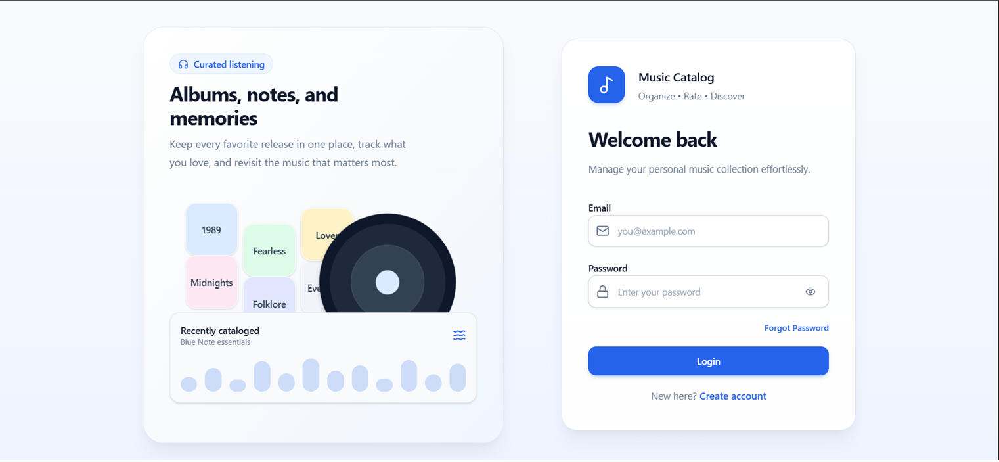
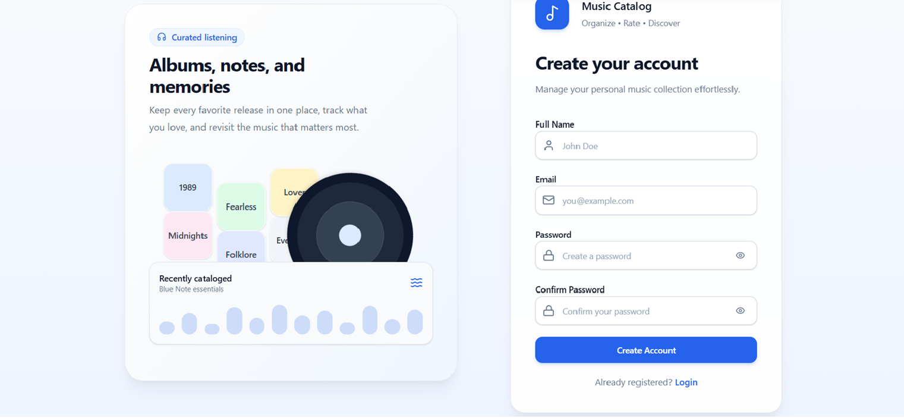
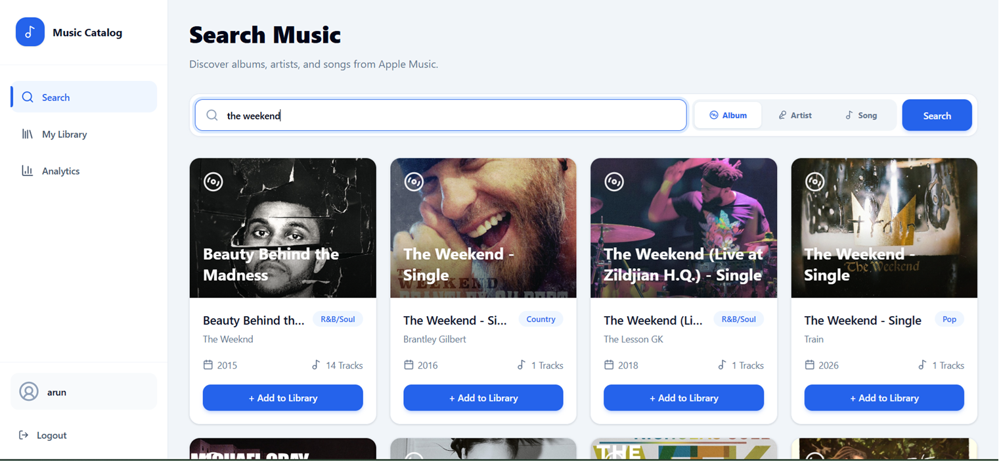
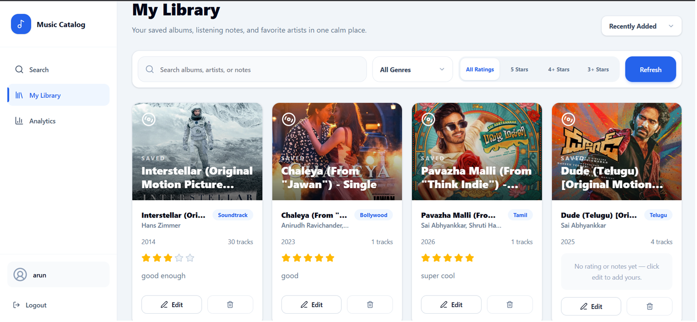
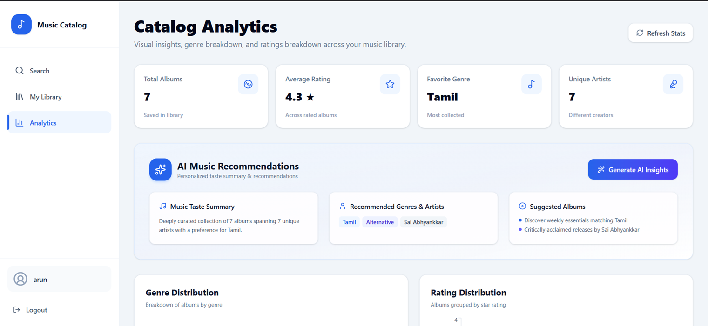
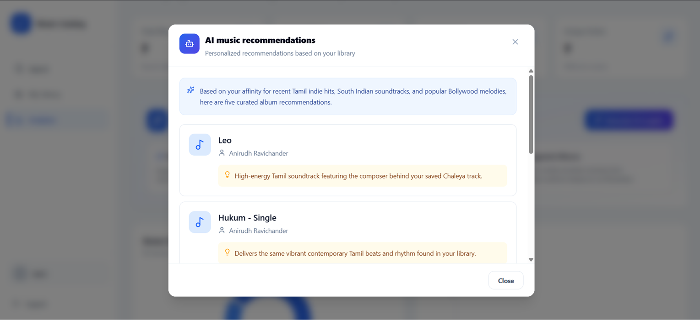
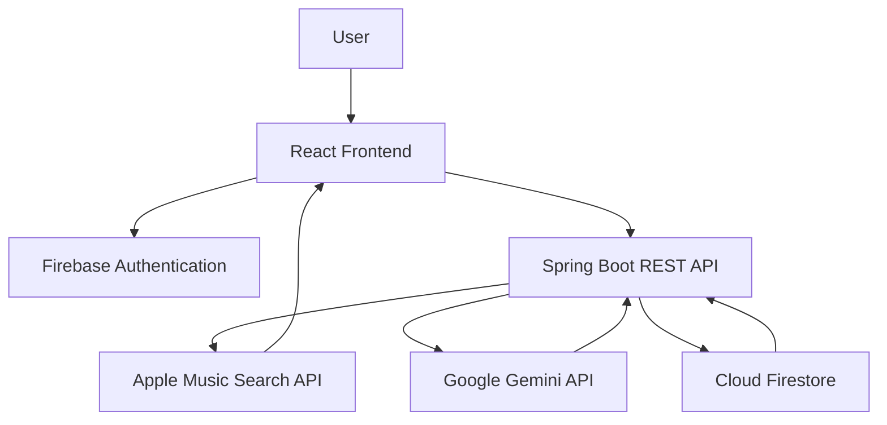

# 🎵 Music Catalog Insights Platform

> A full-stack music library application that enables users to search the Apple Music catalog, build a personalized album collection, visualize listening trends through interactive analytics, and receive AI-powered album recommendations using Google's Gemini API.


---

## 📖 Overview

Music Catalog Insights Platform is a modern full-stack web application that allows users to discover albums from the Apple Music catalog, curate a personal music library, analyze listening patterns through interactive visualizations, and receive AI-powered album recommendations based on their collection.

Unlike traditional CRUD applications, this project combines external API integration, secure authentication, cloud-based storage, analytics, and generative AI into a single cohesive experience.

The application was developed as part of a Full-Stack + AI take-home assignment while extending the required scope with additional usability, security, and user experience improvements.

---

## ✨ Features

### 🔐 Authentication

- Secure email/password authentication using Firebase
- Persistent login sessions
- Protected application routes
- User profile support

### 🔎 Music Search

- Search by album, artist, or song
- Powered by the Apple Music Search API
- Fast debounced search
- Rich album metadata and artwork

### 📚 Personal Library

- Save albums to your personal collection
- Add ratings and personal notes
- Edit or remove saved albums
- Duplicate prevention

### 📊 Analytics Dashboard

- Genre distribution
- Rating distribution
- Top artists
- Albums added over time
- Release year analysis

### 🤖 AI Music Recommendations

- Personalized recommendations using Gemini
- AI-generated listening summary
- Five recommended albums with explanations
- Recommendations based on the user's saved library


## 📸 Screenshots

| Login | Register |
|--------|----------|
|  |  |

| Search | Library |
|--------|----------|
|  |  |

| Analytics Dashboard |
|---------------------|
|  |

| AI Recommendations |
|--------------------|
|  |

---

# 🏗️ System Architecture



The application follows a client-server architecture where the React frontend communicates with a Spring Boot backend through REST APIs. Firebase Authentication secures user access, Firestore stores each user's personal music library, Apple's iTunes Search API provides album data, and Google Gemini generates personalized music recommendations based on the user's collection.

---

# ⚙️ Technology Stack

| Layer | Technology |
|--------|------------|
| Frontend | React + TypeScript + Vite |
| Styling | Tailwind CSS |
| State Management | React Query + React Hooks |
| Charts | Recharts |
| Backend | Spring Boot 3 |
| Language | Java 17 |
| Authentication | Firebase Authentication |
| Database | Cloud Firestore |
| AI | Google Gemini API |
| External API | Apple Music (iTunes Search API) |
| Build Tool | Maven |
| Package Manager | npm |

---

# 🎯 Entity Choice

For this project, **Albums** were selected as the primary entity.

### Why Albums?

Albums provide significantly richer metadata than individual songs or artists. Each album includes information such as:

- Album title
- Artist
- Genre
- Artwork
- Release date
- Track count

This additional information enables more meaningful analytics and AI recommendations.

---

# 🗄️ Database Design

Although the assignment permits either SQL or NoSQL databases, **Cloud Firestore** was selected.

### Why Firestore?

- Seamless integration with Firebase Authentication
- No server setup or database administration
- Flexible document-based schema
- Real-time synchronization capabilities
- Simple scalability for cloud deployments
- Fast development workflow

Each authenticated user stores only their own library, ensuring complete data isolation between users.

---

## Album Schema

| Field | Type | Description |
|-------|------|-------------|
| id | String | Firestore document ID |
| appleCatalogId | Long | Apple Music catalog identifier |
| title | String | Album title |
| artistName | String | Artist(s) |
| genre | String | Primary music genre |
| releaseDate | String | Album release date |
| trackCount | Integer | Number of tracks |
| artworkUrl | String | Album artwork URL |
| userRating | Integer | User rating (1–5) |
| userNotes | String | Personal notes |
| createdAt | Timestamp | Creation timestamp |
| updatedAt | Timestamp | Last updated timestamp |

---


# 🌐 REST API

The backend follows RESTful design principles with clear separation of concerns using the Controller → Service → Repository architecture.

## Search API

| Method | Endpoint | Description |
|---------|----------|-------------|
| GET | `/api/search?query={query}&type={type}` | Search albums from the Apple Music catalog |

### Supported Search Types

- Album
- Artist
- Song

---

## Library API

| Method | Endpoint | Description |
|---------|----------|-------------|
| GET | `/api/library` | Retrieve user's saved albums |
| POST | `/api/library` | Save an album to the library |
| PUT | `/api/library/{id}` | Update rating or notes |
| DELETE | `/api/library/{id}` | Remove an album |

---

## Analytics API

| Method | Endpoint | Description |
|---------|----------|-------------|
| GET | `/api/analytics` | Generate analytics from the user's library |

---

## AI Recommendation API

| Method | Endpoint | Description |
|---------|----------|-------------|
| GET | `/api/ai/recommendations` | Generate AI-powered album recommendations |

---


# 🚀 Performance Optimizations

The application includes several optimizations to improve responsiveness.

- React Query request caching
- Debounced search
- Lazy API fetching
- Optimistic UI updates
- Component reuse
- Responsive layouts
- Loading skeletons
- Efficient Firestore queries

# ⚙️ Getting Started

## Prerequisites

Before running the project, ensure the following software is installed:

- Java 17
- Maven 3.9+
- Node.js 18+
- npm
- Firebase Project
- Google Gemini API Key

---

# 🔑 Environment Variables

## Backend (`application.properties`)

```properties
firebase.config.path=path/to/firebase-service-account.json

apple.api.url=https://itunes.apple.com/search

gemini.api.key=YOUR_GEMINI_API_KEY
gemini.api.url=https://generativelanguage.googleapis.com/v1beta/models/gemini-3.5-flash-lite:generateContent
```

---

## Frontend (`.env`)

```env
VITE_FIREBASE_API_KEY=xxxxxxxxxxxxxxxx
VITE_FIREBASE_AUTH_DOMAIN=xxxxxxxxxxxxxxxx
VITE_FIREBASE_PROJECT_ID=xxxxxxxxxxxxxxxx
VITE_FIREBASE_STORAGE_BUCKET=xxxxxxxxxxxxxxxx
VITE_FIREBASE_MESSAGING_SENDER_ID=xxxxxxxxxxxxxxxx
VITE_FIREBASE_APP_ID=xxxxxxxxxxxxxxxx

VITE_BACKEND_URL=http://localhost:8080
```

---

# ▶️ Running the Backend

Navigate to the backend directory.

```bash
cd music-catalog-backend
```

Install dependencies.

```bash
mvn clean install
```

Start the Spring Boot server.

```bash
mvn spring-boot:run
```

The backend will start on:

```
http://localhost:8080
```

---

# ▶️ Running the Frontend

Navigate to the frontend directory.

```bash
cd music-catalog-frontend
```

Install dependencies.

```bash
npm install
```

Start the development server.

```bash
npm run dev
```

The frontend will be available at:

```
http://localhost:5173
```

---

# 📌 Design Decisions & Trade-offs

During development, several architectural decisions were made to balance functionality, maintainability, and development speed.

### Collaboration-aware Artist Analytics

Instead of treating collaboration strings as a single artist, artist names are parsed and counted individually. This produces more accurate statistics when multiple artists appear on the same album.

### AI Recommendation Strategy

The application does not ask Gemini to search the internet. Instead, it sends only the user's saved library, allowing recommendations to be generated solely from the user's listening preferences. This results in personalized, context-aware suggestions while keeping the prompt concise.

---

# 👨‍💻 Author

**Arun Krishna**

MCA Student • Manipal Institute of Technology

